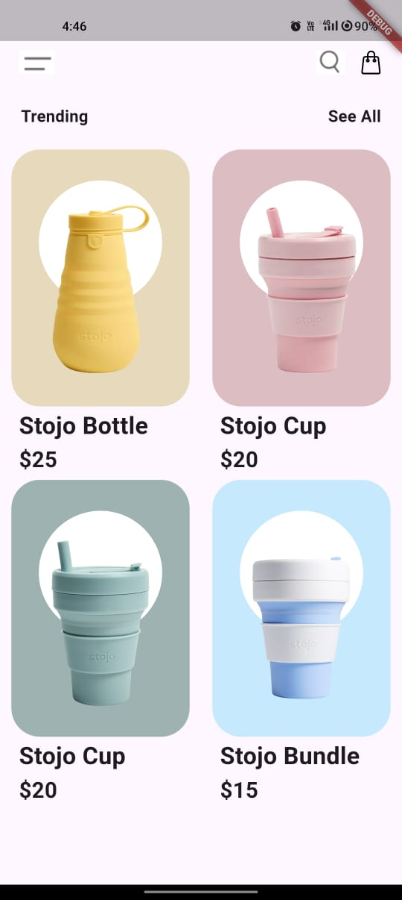
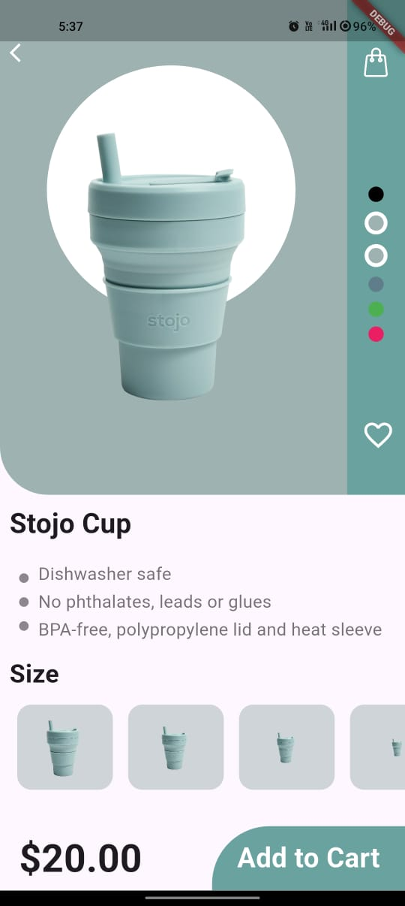

# Stojo UI - Flutter App

A beautiful and modern e-commerce UI built with Flutter.

## 📸 Screenshots

| Home Screen | Product Details |
|-------------|----------------|
|  |  |

## 📦 Features

- 🛒 **Product Listing**: Browse different Stojo products with images and prices.
- 🔍 **Product Details**: View detailed descriptions, color options, and sizes.
- ❤️ **Wishlist**: Add and remove products from favorites.
- 🎨 **Custom UI Design**: Smooth animations and beautiful UI components.

## 🛠️ Technologies Used

- Flutter
- Dart
- Custom Animations & UI Components

## 🚀 Installation

1. Clone the repository:
   ```sh
   git clone https://github.com/your-username/stojo-ui.git
